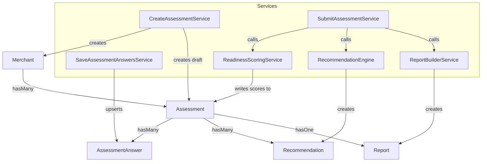

# Architecture Diagrams

Two diagrams covering the domain model and the assessment lifecycle. Both render natively on GitHub (Mermaid) with no additional tooling.

## Domain and data flow



`Merchant` is the root: one merchant can submit multiple assessments over time (e.g. re-assessing, or multiple locations under one company). Each `Assessment` owns its own `AssessmentAnswer` rows (one per question), `Recommendation` rows (generated at submit time), and at most one `Report` (created automatically the moment an assessment is submitted).

## Assessment lifecycle

```mermaid
sequenceDiagram
    actor Visitor
    participant Wizard as Assessment Wizard (Vue)
    participant API as AssessmentController
    participant Create as CreateAssessmentService
    participant Save as SaveAssessmentAnswersService
    participant Submit as SubmitAssessmentService
    participant Score as ReadinessScoringService
    participant Rec as RecommendationEngine
    participant Report as ReportBuilderService

    Visitor->>Wizard: Open /assessment
    Wizard->>API: POST /api/assessments
    API->>Create: createAnonymousDraft()
    Create-->>API: draft Assessment
    API-->>Wizard: assessment id

    loop Each section
        Wizard->>API: POST /api/assessments/{id}/answers
        API->>Save: save(assessment, answers)
        Save-->>API: updated Assessment
    end

    Wizard->>API: POST /api/assessments/{id}/submit
    API->>Submit: submit(assessment)
    Submit->>Score: score(assessment)
    Score-->>Submit: ScoreBreakdown
    Submit->>Rec: generate(assessment, scores)
    Rec-->>Submit: Recommendations
    Submit->>Report: createForAssessment(assessment)
    Report-->>Submit: Report (token, published_at)
    Submit-->>API: submitted Assessment
    API-->>Wizard: score, recommendations, report url
    Wizard-->>Visitor: Inline results + shareable report link
```

No step in this flow requires authentication — the entire lifecycle, from starting a draft through receiving a shareable report link, is available to an anonymous visitor. Authentication only gates the internal workspace (`/dashboard`), which reviews already-submitted assessments after the fact.
