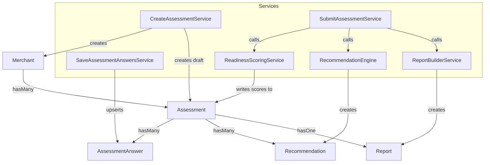

# Milestone 8: Polish, Accessibility, Documentation Implementation Plan

> **For agentic workers:** REQUIRED SUB-SKILL: Use superpowers:subagent-driven-development (recommended) or superpowers:executing-plans to implement this plan task-by-task. Steps use checkbox (`- [ ]`) syntax for tracking.

**Goal:** Close out the execution plan's final milestone — loading-state feedback on the wizard's async calls, targeted accessibility fixes across every page, a README that reflects the actual, fully-built app, and two architecture diagrams.

**Architecture:** Purely additive frontend (Vue template/script) changes plus documentation — no backend code, no schema, no new dependency. Each Vue fix targets a specific, previously-verified gap (not a general aspirational sweep).

**Tech Stack:** Vue 3 `<script setup>`, Tailwind CSS (existing classes only), Mermaid (GitHub-native diagram rendering, no new dependency), Markdown.

## Global Constraints

- No backend/PHP file changes anywhere in this milestone — verification is `npm run build` plus a final `php artisan test` run per task to confirm zero regression (expect the same 155 tests passing throughout, since nothing PHP-related changes).
- No new npm or composer dependency.
- Every accessibility fix targets one of the specific gaps below — do not add speculative ARIA attributes beyond what's listed.
- `AssessmentResults.vue`'s `role="img"` + `aria-label` replaces the SVG's accessible name entirely for assistive tech (this is standard, correct behavior — the inner `<text>` nodes stay visually rendered but are no longer separately exposed to the accessibility tree once the parent has `role="img"`); no `aria-hidden` needed on the inner `<text>` elements.
- README's live demo section must reference the actual current production URL (`https://commerce-cartographer.onrender.com`) and the actual seeded admin credentials (`admin@merchant-readiness.test` / `password`) — both already live in production as of this milestone.

---

## Task 1: Wizard.vue loading states and accessibility

**Files:**
- Modify: `resources/js/Pages/Assessment/Wizard.vue`

**Interfaces:**
- Consumes: nothing new.
- Produces: no prop or route changes — purely internal reactive state (`isSaving`, `isSubmitting`) and template attribute additions. No other file depends on this task.

- [ ] **Step 1: Add loading-state refs and wrap the async handlers**

Read `resources/js/Pages/Assessment/Wizard.vue` first to confirm it matches, then replace the `<script setup>` block's state declarations and the two async functions:

Old:
```js
const currentSectionIndex = ref(0);
const assessmentId = ref(null);
const answers = ref({});
const status = ref('Start your assessment to save draft answers.');
const errors = ref({});
const submitResult = ref(null);
const submitError = ref(null);
```

New:
```js
const currentSectionIndex = ref(0);
const assessmentId = ref(null);
const answers = ref({});
const status = ref('Start your assessment to save draft answers.');
const errors = ref({});
const submitResult = ref(null);
const submitError = ref(null);
const isSaving = ref(false);
const isSubmitting = ref(false);
```

Old:
```js
async function saveSection() {
    await startAssessment();

    errors.value = {};

    const payload = currentSection.value.questions.map((question) => ({
        question_key: question.key,
        value: answers.value[question.key] ?? (question.type === 'multiselect' ? [] : null),
    }));

    try {
        const response = await axios.post(`/api/assessments/${assessmentId.value}/answers`, {
            answers: payload,
        });

        status.value = `Draft saved with ${response.data.assessment.answers_count} answer(s).`;

        if (!isLastSection.value) {
            currentSectionIndex.value += 1;
        }
    } catch (error) {
        errors.value = error.response?.data?.errors ?? {};
        status.value = 'Check the highlighted answers before continuing.';
    }
}
```

New:
```js
async function saveSection() {
    isSaving.value = true;

    try {
        await startAssessment();

        errors.value = {};

        const payload = currentSection.value.questions.map((question) => ({
            question_key: question.key,
            value: answers.value[question.key] ?? (question.type === 'multiselect' ? [] : null),
        }));

        try {
            const response = await axios.post(`/api/assessments/${assessmentId.value}/answers`, {
                answers: payload,
            });

            status.value = `Draft saved with ${response.data.assessment.answers_count} answer(s).`;

            if (!isLastSection.value) {
                currentSectionIndex.value += 1;
            }
        } catch (error) {
            errors.value = error.response?.data?.errors ?? {};
            status.value = 'Check the highlighted answers before continuing.';
        }
    } finally {
        isSaving.value = false;
    }
}
```

Old:
```js
async function submitAssessment() {
    submitError.value = null;

    try {
        const response = await axios.post(`/api/assessments/${assessmentId.value}/submit`);
        submitResult.value = response.data;
    } catch (error) {
        if (error.response?.status === 409) {
            submitError.value = 'This assessment has already been submitted.';
        } else {
            errors.value = error.response?.data?.errors ?? {};

            const sections = missingSectionLabels();
            submitError.value = sections.length
                ? `Missing required answers in: ${sections.join(', ')}.`
                : 'Check the highlighted answers before submitting.';
        }
    }
}
```

New:
```js
async function submitAssessment() {
    submitError.value = null;
    isSubmitting.value = true;

    try {
        const response = await axios.post(`/api/assessments/${assessmentId.value}/submit`);
        submitResult.value = response.data;
    } catch (error) {
        if (error.response?.status === 409) {
            submitError.value = 'This assessment has already been submitted.';
        } else {
            errors.value = error.response?.data?.errors ?? {};

            const sections = missingSectionLabels();
            submitError.value = sections.length
                ? `Missing required answers in: ${sections.join(', ')}.`
                : 'Check the highlighted answers before submitting.';
        }
    } finally {
        isSubmitting.value = false;
    }
}
```

- [ ] **Step 2: Add accessibility attributes and loading-state feedback to the template**

Read the current `<template>` block to confirm it matches, then apply these replacements:

Old:
```html
                <div class="mb-8 grid gap-3 sm:grid-cols-6">
                    <button
                        v-for="(section, index) in catalog"
                        :key="section.key"
                        type="button"
                        class="rounded-2xl border px-4 py-3 text-left text-sm transition"
                        :class="index === currentSectionIndex ? 'border-blue-400 bg-blue-50 text-blue-700' : 'border-slate-200 bg-white text-slate-600'"
                        @click="currentSectionIndex = index"
                    >
                        {{ section.label }}
                    </button>
                </div>
```

New:
```html
                <div class="mb-8 grid gap-3 sm:grid-cols-6">
                    <button
                        v-for="(section, index) in catalog"
                        :key="section.key"
                        type="button"
                        class="rounded-2xl border px-4 py-3 text-left text-sm transition"
                        :class="index === currentSectionIndex ? 'border-blue-400 bg-blue-50 text-blue-700' : 'border-slate-200 bg-white text-slate-600'"
                        :aria-current="index === currentSectionIndex ? 'step' : undefined"
                        @click="currentSectionIndex = index"
                    >
                        {{ section.label }}
                    </button>
                </div>
```

Old:
```html
                <form class="rounded-3xl border border-slate-200 bg-white p-6 shadow-sm" @submit.prevent="saveSection">
                    <div class="mb-6 flex flex-col justify-between gap-3 sm:flex-row sm:items-center">
                        <div>
                            <p class="text-sm font-medium text-blue-600">Section {{ currentSectionIndex + 1 }} of {{ catalog.length }}</p>
                            <h2 class="mt-1 text-2xl font-semibold">{{ currentSection.label }}</h2>
                        </div>
                        <p class="text-sm text-slate-500">{{ status }}</p>
                    </div>

                    <div class="space-y-6">
                        <label v-for="(question, questionIndex) in currentSection.questions" :key="question.key" class="block">
                            <span class="mb-2 block text-sm font-medium text-slate-900">
                                {{ question.label }}
                                <span v-if="question.required" class="text-blue-600">*</span>
                            </span>

                            <input
                                v-if="['text', 'email'].includes(question.type)"
                                v-model="answers[question.key]"
                                :type="question.type"
                                class="w-full rounded-xl border border-slate-300 bg-white px-4 py-3 text-slate-900 outline-none ring-blue-500 transition focus:ring-2"
                            >

                            <select
                                v-else-if="question.type === 'select'"
                                v-model="answers[question.key]"
                                class="w-full rounded-xl border border-slate-300 bg-white px-4 py-3 text-slate-900 outline-none ring-blue-500 transition focus:ring-2"
                            >
                                <option :value="null">Choose one</option>
                                <option v-for="option in question.options" :key="option" :value="option">{{ option }}</option>
                            </select>

                            <div v-else-if="question.type === 'multiselect'" class="grid gap-2 sm:grid-cols-2">
                                <label v-for="option in question.options" :key="option" class="flex items-center gap-3 rounded-xl border border-slate-300 bg-white px-4 py-3 text-sm text-slate-700">
                                    <input v-model="answers[question.key]" type="checkbox" :value="option" class="rounded border-slate-300 text-blue-600">
                                    {{ option }}
                                </label>
                            </div>

                            <select
                                v-else-if="question.type === 'boolean'"
                                v-model="answers[question.key]"
                                class="w-full rounded-xl border border-slate-300 bg-white px-4 py-3 text-slate-900 outline-none ring-blue-500 transition focus:ring-2"
                            >
                                <option :value="null">Choose one</option>
                                <option :value="true">Yes</option>
                                <option :value="false">No</option>
                            </select>

                            <p v-if="questionError(questionIndex)" class="mt-2 text-sm text-red-600">
                                {{ questionError(questionIndex) }}
                            </p>
                        </label>
                    </div>

                    <div class="mt-8 flex flex-col gap-3 sm:flex-row sm:justify-between">
                        <button type="button" class="rounded-xl border border-slate-300 px-5 py-3 text-sm font-semibold text-slate-700 disabled:opacity-40" :disabled="currentSectionIndex === 0" @click="previousSection">
                            Previous
                        </button>
                        <button type="submit" class="rounded-xl bg-blue-600 px-5 py-3 text-sm font-semibold text-white shadow-lg shadow-blue-200 transition hover:bg-blue-700">
                            {{ isLastSection ? 'Save final draft section' : 'Save and continue' }}
                        </button>
                    </div>
                </form>

                <div v-if="isLastSection" class="mt-6 flex justify-end">
                    <button
                        type="button"
                        class="rounded-xl border border-blue-300 bg-blue-50 px-5 py-3 text-sm font-semibold text-blue-700 transition hover:bg-blue-100"
                        @click="submitAssessment"
                    >
                        Submit assessment
                    </button>
                </div>

                <p v-if="submitError" class="mt-3 text-right text-sm text-red-600">{{ submitError }}</p>
```

New:
```html
                <form class="rounded-3xl border border-slate-200 bg-white p-6 shadow-sm" @submit.prevent="saveSection">
                    <div class="mb-6 flex flex-col justify-between gap-3 sm:flex-row sm:items-center">
                        <div>
                            <p class="text-sm font-medium text-blue-600">Section {{ currentSectionIndex + 1 }} of {{ catalog.length }}</p>
                            <h2 class="mt-1 text-2xl font-semibold">{{ currentSection.label }}</h2>
                        </div>
                        <p class="text-sm text-slate-500" role="status" aria-live="polite">{{ status }}</p>
                    </div>

                    <div class="space-y-6">
                        <label v-for="(question, questionIndex) in currentSection.questions" :key="question.key" class="block">
                            <span class="mb-2 block text-sm font-medium text-slate-900">
                                {{ question.label }}
                                <span v-if="question.required" class="text-blue-600">*</span>
                            </span>

                            <input
                                v-if="['text', 'email'].includes(question.type)"
                                v-model="answers[question.key]"
                                :type="question.type"
                                :aria-required="question.required"
                                class="w-full rounded-xl border border-slate-300 bg-white px-4 py-3 text-slate-900 outline-none ring-blue-500 transition focus:ring-2"
                            >

                            <select
                                v-else-if="question.type === 'select'"
                                v-model="answers[question.key]"
                                :aria-required="question.required"
                                class="w-full rounded-xl border border-slate-300 bg-white px-4 py-3 text-slate-900 outline-none ring-blue-500 transition focus:ring-2"
                            >
                                <option :value="null">Choose one</option>
                                <option v-for="option in question.options" :key="option" :value="option">{{ option }}</option>
                            </select>

                            <div v-else-if="question.type === 'multiselect'" class="grid gap-2 sm:grid-cols-2">
                                <label v-for="option in question.options" :key="option" class="flex items-center gap-3 rounded-xl border border-slate-300 bg-white px-4 py-3 text-sm text-slate-700">
                                    <input v-model="answers[question.key]" type="checkbox" :value="option" class="rounded border-slate-300 text-blue-600">
                                    {{ option }}
                                </label>
                            </div>

                            <select
                                v-else-if="question.type === 'boolean'"
                                v-model="answers[question.key]"
                                :aria-required="question.required"
                                class="w-full rounded-xl border border-slate-300 bg-white px-4 py-3 text-slate-900 outline-none ring-blue-500 transition focus:ring-2"
                            >
                                <option :value="null">Choose one</option>
                                <option :value="true">Yes</option>
                                <option :value="false">No</option>
                            </select>

                            <p v-if="questionError(questionIndex)" class="mt-2 text-sm text-red-600">
                                {{ questionError(questionIndex) }}
                            </p>
                        </label>
                    </div>

                    <div class="mt-8 flex flex-col gap-3 sm:flex-row sm:justify-between">
                        <button
                            type="button"
                            class="rounded-xl border border-slate-300 px-5 py-3 text-sm font-semibold text-slate-700 disabled:opacity-40"
                            :disabled="currentSectionIndex === 0 || isSaving || isSubmitting"
                            @click="previousSection"
                        >
                            Previous
                        </button>
                        <button
                            type="submit"
                            class="rounded-xl bg-blue-600 px-5 py-3 text-sm font-semibold text-white shadow-lg shadow-blue-200 transition hover:bg-blue-700 disabled:opacity-60"
                            :disabled="isSaving"
                            :aria-busy="isSaving"
                        >
                            {{ isSaving ? 'Saving…' : (isLastSection ? 'Save final draft section' : 'Save and continue') }}
                        </button>
                    </div>
                </form>

                <div v-if="isLastSection" class="mt-6 flex justify-end">
                    <button
                        type="button"
                        class="rounded-xl border border-blue-300 bg-blue-50 px-5 py-3 text-sm font-semibold text-blue-700 transition hover:bg-blue-100 disabled:opacity-60"
                        :disabled="isSubmitting"
                        :aria-busy="isSubmitting"
                        @click="submitAssessment"
                    >
                        {{ isSubmitting ? 'Submitting…' : 'Submit assessment' }}
                    </button>
                </div>

                <p v-if="submitError" class="mt-3 text-right text-sm text-red-600" role="alert">{{ submitError }}</p>
```

- [ ] **Step 3: Verify the build**

There is no automated JS test suite in this project. Run:

Run: `npm run build`
Expected: builds successfully with no errors.

- [ ] **Step 4: Run the full backend test suite**

Run: `php artisan test`
Expected: PASS (155 tests — this task touches no PHP file, so the count is unchanged from before this milestone).

- [ ] **Step 5: Commit**

```bash
git add resources/js/Pages/Assessment/Wizard.vue
git commit -m "Add loading states and accessibility attributes to the assessment wizard"
```

---

## Task 2: Accessibility fixes across the remaining pages

**Files:**
- Modify: `resources/js/Components/ApplicationLogo.vue`
- Modify: `resources/js/Pages/Assessment/AssessmentResults.vue`
- Modify: `resources/js/Pages/Workspace/Index.vue`
- Modify: `resources/js/Pages/Workspace/Show.vue`

**Interfaces:**
- Consumes: nothing new.
- Produces: no prop or behavior changes to any of these components — purely additive ARIA attributes and (for `Workspace/Index.vue`) a new `ariaSortFor(column)` helper function alongside the existing `sortIndicator(column)`.

- [ ] **Step 1: `ApplicationLogo.vue` — mark the decorative logo hidden from assistive tech**

Read `resources/js/Components/ApplicationLogo.vue` first to confirm it matches, then replace the opening `<svg>` tag only:

Old:
```html
    <svg viewBox="0 0 316 316" xmlns="http://www.w3.org/2000/svg">
```

New:
```html
    <svg viewBox="0 0 316 316" xmlns="http://www.w3.org/2000/svg" aria-hidden="true" focusable="false">
```

- [ ] **Step 2: `AssessmentResults.vue` — give the score ring a coherent accessible name**

Read `resources/js/Pages/Assessment/AssessmentResults.vue` first to confirm it matches, then add a computed and update the `<svg>` tag:

Old:
```js
const overallScore = computed(() => props.result.assessment.overall_score);
const overallTier = computed(() => props.result.assessment.overall_tier);
const ringOffset = computed(() => RING_CIRCUMFERENCE * (1 - overallScore.value / 100));
```

New:
```js
const overallScore = computed(() => props.result.assessment.overall_score);
const overallTier = computed(() => props.result.assessment.overall_tier);
const ringOffset = computed(() => RING_CIRCUMFERENCE * (1 - overallScore.value / 100));
const scoreSummary = computed(() => `Score: ${overallScore.value} out of 100, ${overallTier.value} tier`);
```

Old:
```html
            <svg viewBox="0 0 120 120" class="h-32 w-32 shrink-0">
```

New:
```html
            <svg viewBox="0 0 120 120" class="h-32 w-32 shrink-0" role="img" :aria-label="scoreSummary">
```

- [ ] **Step 3: `Workspace/Index.vue` — accessible search label and keyboard-usable sortable columns**

Read `resources/js/Pages/Workspace/Index.vue` first to confirm it matches, then apply these replacements:

Old:
```js
function sortIndicator(column) {
    if (props.filters.sort !== column) {
        return '';
    }

    return props.filters.direction === 'asc' ? '▲' : '▼';
}
```

New:
```js
function sortIndicator(column) {
    if (props.filters.sort !== column) {
        return '';
    }

    return props.filters.direction === 'asc' ? '▲' : '▼';
}

function ariaSortFor(column) {
    if (props.filters.sort !== column) {
        return 'none';
    }

    return props.filters.direction === 'asc' ? 'ascending' : 'descending';
}
```

Old:
```html
                            <input
                                v-model="search"
                                type="text"
                                placeholder="Search by company or contact name"
                                class="w-full max-w-sm rounded-xl border border-slate-300 px-4 py-2 text-sm text-slate-900 outline-none ring-blue-500 transition focus:ring-2"
                            >
```

New:
```html
                            <input
                                v-model="search"
                                type="text"
                                placeholder="Search by company or contact name"
                                aria-label="Search by company or contact name"
                                class="w-full max-w-sm rounded-xl border border-slate-300 px-4 py-2 text-sm text-slate-900 outline-none ring-blue-500 transition focus:ring-2"
                            >
```

Old:
```html
                    <table class="w-full text-left text-sm">
                        <thead>
                            <tr class="border-b border-slate-200 text-slate-500">
                                <th class="cursor-pointer select-none py-2 pr-4 font-medium" @click="sortBy('company')">
                                    Company / Contact {{ sortIndicator('company') }}
                                </th>
                                <th class="cursor-pointer select-none py-2 pr-4 font-medium" @click="sortBy('tier')">
                                    Tier / Score {{ sortIndicator('tier') }}
                                </th>
                                <th class="cursor-pointer select-none py-2 pr-4 font-medium" @click="sortBy('submitted_at')">
                                    Submitted {{ sortIndicator('submitted_at') }}
                                </th>
                            </tr>
                        </thead>
```

New:
```html
                    <table class="w-full text-left text-sm">
                        <thead>
                            <tr class="border-b border-slate-200 text-slate-500">
                                <th class="py-2 pr-4 font-medium" :aria-sort="ariaSortFor('company')">
                                    <button type="button" class="select-none hover:text-slate-900" @click="sortBy('company')">
                                        Company / Contact {{ sortIndicator('company') }}
                                    </button>
                                </th>
                                <th class="py-2 pr-4 font-medium" :aria-sort="ariaSortFor('tier')">
                                    <button type="button" class="select-none hover:text-slate-900" @click="sortBy('tier')">
                                        Tier / Score {{ sortIndicator('tier') }}
                                    </button>
                                </th>
                                <th class="py-2 pr-4 font-medium" :aria-sort="ariaSortFor('submitted_at')">
                                    <button type="button" class="select-none hover:text-slate-900" @click="sortBy('submitted_at')">
                                        Submitted {{ sortIndicator('submitted_at') }}
                                    </button>
                                </th>
                            </tr>
                        </thead>
```

- [ ] **Step 4: `Workspace/Show.vue` — hide the decorative arrow from assistive tech**

Read `resources/js/Pages/Workspace/Show.vue` first to confirm it matches, then replace:

Old:
```html
            <Link :href="route('dashboard')" class="text-sm font-medium text-blue-600 hover:text-blue-700">&larr; Back to prospects</Link>
```

New:
```html
            <Link :href="route('dashboard')" class="text-sm font-medium text-blue-600 hover:text-blue-700"><span aria-hidden="true">&larr;</span> Back to prospects</Link>
```

- [ ] **Step 5: Verify the build**

Run: `npm run build`
Expected: builds successfully with no errors.

- [ ] **Step 6: Run the full backend test suite**

Run: `php artisan test`
Expected: PASS (155 tests, unchanged).

- [ ] **Step 7: Commit**

```bash
git add resources/js/Components/ApplicationLogo.vue resources/js/Pages/Assessment/AssessmentResults.vue resources/js/Pages/Workspace/Index.vue resources/js/Pages/Workspace/Show.vue
git commit -m "Add targeted accessibility fixes across remaining pages"
```

---

## Task 3: README rewrite and architecture diagrams

**Files:**
- Modify: `README.md`
- Create: `docs/architecture-diagrams.md`

**Interfaces:**
- Consumes: nothing — pure documentation.
- Produces: nothing later depends on.

- [ ] **Step 1: Create the architecture diagrams doc**

`docs/architecture-diagrams.md`:
```markdown
# Architecture Diagrams

Two diagrams covering the domain model and the assessment lifecycle. Both render natively on GitHub (Mermaid) with no additional tooling.

## Domain and data flow



`Merchant` is the root: one merchant can submit multiple assessments over time (e.g. re-assessing, or multiple locations under one company). Each `Assessment` owns its own `AssessmentAnswer` rows (one per question), `Recommendation` rows (generated at submit time), and at most one `Report` (created automatically the moment an assessment is submitted).

## Assessment lifecycle

```mermaid
sequenceDiagram
    actor Visitor
    participant Wizard as Assessment Wizard (Vue)
    participant API as AssessmentController
    participant Create as CreateAssessmentService
    participant Save as SaveAssessmentAnswersService
    participant Submit as SubmitAssessmentService
    participant Score as ReadinessScoringService
    participant Rec as RecommendationEngine
    participant Report as ReportBuilderService

    Visitor->>Wizard: Open /assessment
    Wizard->>API: POST /api/assessments
    API->>Create: createAnonymousDraft()
    Create-->>API: draft Assessment
    API-->>Wizard: assessment id

    loop Each section
        Wizard->>API: POST /api/assessments/{id}/answers
        API->>Save: save(assessment, answers)
        Save-->>API: updated Assessment
    end

    Wizard->>API: POST /api/assessments/{id}/submit
    API->>Submit: submit(assessment)
    Submit->>Score: score(assessment)
    Score-->>Submit: ScoreBreakdown
    Submit->>Rec: generate(assessment, scores)
    Rec-->>Submit: Recommendations
    Submit->>Report: createForAssessment(assessment)
    Report-->>Submit: Report (token, published_at)
    Submit-->>API: submitted Assessment
    API-->>Wizard: score, recommendations, report url
    Wizard-->>Visitor: Inline results + shareable report link
```

No step in this flow requires authentication — the entire lifecycle, from starting a draft through receiving a shareable report link, is available to an anonymous visitor. Authentication only gates the internal workspace (`/dashboard`), which reviews already-submitted assessments after the fact.
```

- [ ] **Step 2: Rewrite the README**

Read `README.md` first to confirm it matches, then replace it entirely:

```markdown
# Merchant Readiness Workspace

Merchant Readiness Workspace is a Laravel + Vue + Inertia application that helps ecommerce merchants evaluate the maturity of their returns operations through a guided assessment, transparent rule-based scoring, actionable recommendations, and a shareable report — all before any sales conversation.

## Live Demo

- **App:** https://commerce-cartographer.onrender.com
- **Start an assessment** (no login required): https://commerce-cartographer.onrender.com/assessment
- **Internal workspace login:** `admin@merchant-readiness.test` / `password` — seeded automatically, reviews the demo merchants below without needing to submit anything yourself.

The production database is seeded with three realistic demo merchants spanning the readiness tiers (Foundational, Established, Advanced), so the internal workspace's prospect list, search/sort, and review page all have something real to show.

## Features

- **Public assessment wizard** — six sections (Business, Catalog, Return Policy, Exchanges, Manual Operations, Platform), completable anonymously, with draft answers saved section-by-section.
- **Rule-based scoring and recommendations** — transparent, weighted section scoring rolled up into four readiness tiers (Foundational/Developing/Established/Advanced), with recommendations generated from the actual answers, not a black box.
- **Shareable public report** — every submitted assessment gets a secure, tokenized report URL, accessible without authentication.
- **Internal workspace** — an authenticated prospect list (search, sortable columns, tier filtering by sort) and a review page per assessment with a rule-based Talking Points panel for sales/CS conversations.
- **Demo data** — three fully-submitted demo merchants generated through the exact same services a real merchant uses (not hand-computed), plus `php artisan demo:reset` to regenerate them on demand without ever touching real prospect data.

## Tech Stack

- Laravel 11 (PHP 8.2)
- Vue 3 + Inertia.js
- Tailwind CSS
- PostgreSQL in production (Render), SQLite for local development
- Laravel queues (available for async work; not yet required by any current feature)

## Local Development

### Quick setup

```bash
composer run setup
```

This installs PHP and Node dependencies, copies `.env.example` to `.env`, generates an application key, runs migrations, and builds frontend assets.

### Manual setup

```bash
composer install
npm install
cp .env.example .env
php artisan key:generate
php artisan migrate
npm run build
```

### Seed demo data

```bash
php artisan db:seed
```

Creates the admin user and three demo merchants. Safe to run more than once — it's idempotent per-merchant, so a partial run self-heals rather than duplicating anything. Regenerate the demo merchants at any time (including in production) with:

```bash
php artisan demo:reset
```

This command only ever deletes and recreates rows flagged `is_demo` — it can never touch a real prospect's submitted assessment.

### Run the app

```bash
php artisan serve
```

Or run the server, queue listener, log viewer, and Vite dev server together:

```bash
composer run dev
```

## Testing

```bash
php artisan test
```

## Architecture

- `docs/01_Architecture_Implementation_Document.md` — full architecture write-up.
- `docs/architecture-diagrams.md` — domain/data-flow and assessment-lifecycle diagrams.
- `docs/02_Design_Approach.md` — UI/UX direction.
- `docs/04_Product_Requirements_Document.md` — product requirements.

## Render Deployment

Render is configured through Docker:

- `Dockerfile`
- `render.yaml`
- `/health`
- `docs/render-deployment.md`

Render settings when creating the service manually:

- Language/runtime: Docker
- Root directory: blank
- Dockerfile path: `./Dockerfile`
- Instance type: Free
- Health check path: `/health`

Required production environment variables are documented in `docs/render-deployment.md`. For Neon, set `DATABASE_URL` in Render rather than separate `DB_HOST`, `DB_DATABASE`, `DB_USERNAME`, and `DB_PASSWORD` values.

Developer dashboard links, local testing commands, and deployment utilities are collected in `docs/developer-resources.md`.

## Project Status

Every planned milestone is complete and deployed to production:

- Deployment foundation (Laravel, Render, CI, `/health`)
- Authentication, core models, and relationships
- Assessment question catalog and public wizard
- Scoring and recommendation engines
- Results dashboard
- Public, tokenized shareable report
- Internal workspace (prospect list, review page, talking points)
- Demo data and a safe reset command
- Polish, accessibility, loading states, and this documentation
```

- [ ] **Step 3: Verify the build**

Run: `npm run build`
Expected: builds successfully with no errors (confirms nothing in the doc-only changes accidentally broke anything — this step is mostly a formality since neither file touched here is part of the frontend build, but it's run for consistency with every other task in this milestone).

- [ ] **Step 4: Run the full backend test suite**

Run: `php artisan test`
Expected: PASS (155 tests, unchanged).

- [ ] **Step 5: Commit**

```bash
git add README.md docs/architecture-diagrams.md
git commit -m "Rewrite README and add architecture diagrams"
```

---

## Final verification

- [ ] Confirm all 3 tasks are complete and committed.
- [ ] Confirm CI is green on the branch before merging, per the "Deployment must be proven before feature development continues" guardrail in CLAUDE.md.
- [ ] This is the final milestone in the execution plan. Per explicit instruction, after the final whole-branch review passes, proceed directly through `finishing-a-development-branch` choosing the merge-locally option without pausing to ask, then push to `origin/main`, then verify the Render deployment goes live and `/health` returns 200 — completing the "Deployment verification" item from the spec as the closing action of this milestone, not a separate manual step.
